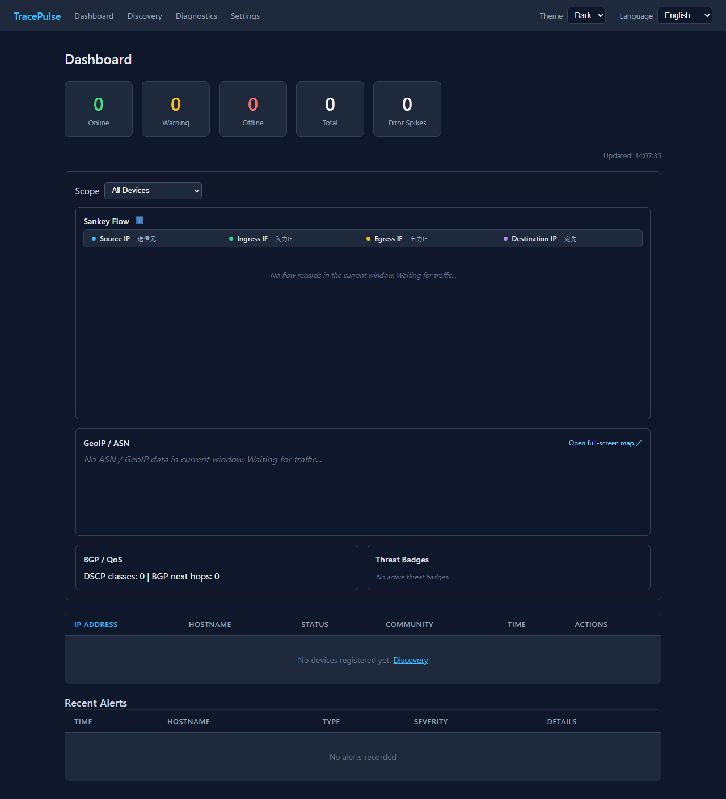

# TracePulse

> Portable, single-binary network monitoring with an interactive TUI and an embedded Web UI.

[](https://github.com/traceworks-co-jp/trace-pulse/actions/workflows/ci.yml)
[](LICENSE-MIT)

TracePulse is a Rust-powered network device monitoring tool for SNMP health
monitoring, anomaly detection, flow analytics, discovery, and topology
mapping. It ships as one portable binary with an embedded SQLite database and
supports both an interactive terminal dashboard (TUI) and a browser-based Web
UI.

- [Quick Start](#quick-start)
- [Screenshots](#screenshots)
- [Key Features](#key-features)
- [Contributing](CONTRIBUTING.md)
- [English Documentation](#english)
- [日本語ドキュメント](#日本語)

---

## Quick Start

Download the archive for your platform from the [latest release](https://github.com/traceworks-co-jp/trace-pulse/releases/latest), extract it, and run one of the following commands:

```bash
# Interactive terminal dashboard
./tracepulse --cli

# Embedded Web UI
./tracepulse --web
```

On Windows, use `tracepulse.exe --cli` or `tracepulse.exe --web`.
Web UI mode is available at `http://localhost:8080` after startup.

## Screenshots

### Web UI Dashboard



The TUI is available immediately after running `./tracepulse --cli` (or
`tracepulse.exe --cli` on Windows). A dedicated TUI capture will be added to
the release assets once a representative monitoring dataset is available.

## Key Features

- **Single Binary & Portable Execution**
  - Self-contained execution with SQLite (`data.db`) and configuration (`config.toml`). Portable across folders or USB drives without external database installation.
- **Interactive 3-Pane TUI Dashboard**
  - Fullscreen terminal UI built with `Ratatui` and `Crossterm`. Enables rapid troubleshooting for topology, port errors, and alert streams without needing a web browser.
- **Embedded WebGUI**
  - Web dashboard featuring multi-device monitoring, real-time charts for bandwidth, error counters, and CPU/memory utilization, as well as auto-generated topology maps via LLDP/CDP.
- **Template-Driven Multi-Vendor Support**
  - Easily extend OIDs for Cisco, Fortinet, Yamaha, etc., using TOML templates (`templates/*.toml`). Supports both direct (`mode = "direct"`) and calculated (`mode = "calculated"`) memory metrics.
- **Network Discovery & Topology Detection**
  - Parallel CIDR host scanning and automated neighbor port discovery via LLDP and CDP.
- **Health Scoring & Anomaly Detection**
  - Real-time detection of L1/L2 errors, discards, late collisions (duplex mismatch), traffic spikes, and automated health score calculation.

---

## System Requirements

- **OS**: Verified on Windows 11 and Ubuntu 26.04. TracePulse also builds for macOS (see the `cfg(target_os = "macos")` branches in `src/web/server.rs`), but macOS has not yet been verified by the maintainers.
- **Architecture**: x86_64.
- **Network access**: SNMP reachability (UDP/161, v1/v2c/v3) to monitored devices, and optionally UDP 2055/4739/6343 if NetFlow/IPFIX/sFlow ingestion is used.
- No external database or additional runtime is required; TracePulse ships as a single portable binary with an embedded SQLite database.

## Supported Devices

### Supported vendors (OID templates)

TracePulse ships with OID templates (`templates/*.toml`) for the following vendors: Alcatel, Arista, Aruba, F5 (BIG-IP), Brocade, Brocade/Foundry, Check Point, Ciena, Cisco, Cradlepoint, Dell, D-Link, Extreme, Fortinet, Generic (standard RFC MIBs), HP, Huawei, Intel/QLogic, Juniper, Mellanox, Meraki, MikroTik, Morningstar, Netgear, Palo Alto, Qtech, Ribbon, Stormshield, TP-Link, Ubiquiti, VeloCloud, Vyatta, and Zyxel.

Devices without a dedicated template can still be monitored through the `generic.toml` template, which relies on standard MIBs (IF-MIB, HOST-RESOURCES-MIB, ENTITY-MIB, etc.).

### Verified hardware

- Cisco Catalyst 2960X series (verified on real hardware by the maintainers)

Devices outside this list are expected to work as long as they expose the relevant SNMP MIBs, but they have not been verified on real hardware. Verification reports from users are welcome via GitHub Discussions/Issues.

## Getting Started

### 1. First launch

1. Download the archive for your platform from the [latest release](https://github.com/traceworks-co-jp/trace-pulse/releases/latest), then extract it. Keep the executable, `config.toml`, and the `templates/` directory in the same folder.
2. Edit `config.toml`, at minimum `[snmp] default_community` and `[polling] interval_seconds`.
3. Start the application in TUI or Web UI mode:

   ```bash
   ./tracepulse --cli
   # or
   ./tracepulse --web
   ```

### 2. Register devices

- **Discovery (recommended)**: In the TUI, press `d`; in the WebGUI, open the Device Discovery page. Specify a CIDR (e.g. `192.168.1.0/24`) and register the devices that respond over SNMP.
- **Manual registration**: Register a single device by IP address, SNMP community, and device type.
- **Bulk import**: Add `[[devices]]` entries to a TOML file, or import from CSV.

### 3. Confirm monitoring is working

1. After registration, the device appears in the device list and polling starts at the configured interval.
2. Over 1-2 polling cycles, confirm that interface status, In/Out errors, discards, and bandwidth utilization are updating.
3. Adjust thresholds under `[alert]` in `config.toml` as needed.

See [docs/guide/user-operation-flow.md](docs/guide/user-operation-flow.md) for a more detailed walkthrough.

---

## How to Run

### 1. TUI Mode
Launch the interactive terminal dashboard:

```bash
cargo run -- --cli
# Or compiled binary:
./tracepulse --cli
```

### 2. WebGUI Mode
Start the embedded web server and access via web browser:

```bash
cargo run -- --web
# Or:
./tracepulse --web
```
After launching, open `http://localhost:8080` in your web browser.

---

## User Operations Guide

### TUI Mode Keyboard Shortcuts

In TUI mode, all operations can be performed using keyboard shortcuts:

| Key | Function |
| :---: | :--- |
| **`Tab`** | **Switch Pane Focus**: Toggle focus between Device List (Top) and Interface List (Middle). |
| **`↑` / `↓`** or **`k` / `j`** | **Navigate / Scroll**: Move selection up/down. Auto-scrolls for devices with many ports. |
| **`Enter`** | **Context detail**: Open the Interface Error Breakdown in the Interface pane, or the Flow Inspector for the selected Top Talker in Protocol View. |
| **`r`** | **Manual Poll**: Perform immediate SNMP polling for all devices with progress bar overlay. |
| **`d`** | **Network Discovery Modal**: Open CIDR discovery dialog for automated device scanning & registration. |
| **`p`** | **Toggle Protocol View**: Switch the middle pane to Protocol & Traffic View. When entered from Interfaces, the selected interface is applied as the flow filter. |
| **`c`** | **Clear filter**: Return Protocol View to All Interfaces, or clear the incremental text filter. |
| **`1` / `2` / `3`** | **Time window**: Select 60 seconds, 5 minutes, or 1 hour in Protocol View. |
| **`s`** | **Sort Top Talkers**: Cycle Bps, PPS, and Bytes order in Protocol View. |
| **`Space`** | **Pause / Resume**: Freeze or resume TUI rendering while keyboard input remains available. |
| **`/`** | **Incremental filter**: Search IP, port, protocol, hostname, or interface text across visible lists and Top Talkers. Press `Esc` or `c` to clear. |
| **`q`** / **`Esc`** | **Quit / Cancel**: Safely exit TUI or close the active modal dialog. |

#### Protocol & Traffic View

The Protocol View is a compact, terminal-width-friendly view containing:

- Protocol share and top applications.
- Top Talkers with Source/Destination, Protocol, Bytes, Bps, PPS, TCP flags, and In/Out interface names.
- The selected Top Talker is highlighted; use `↑` / `k` and `↓` / `j` to move, then `Enter` to open Flow Inspector.
- Flow Inspector shows the tuple, bytes, packets, Bps/PPS, flags, resolved interface names, and sampling correction status. Active/Inactive timeout values are shown as unavailable when they were not retained by the flow record.
- Ingest sampling-rate correction is applied before persistence; displayed values are estimates when exporter sampling metadata is unavailable.

#### Network Discovery Modal Controls

1. Press **`d`** to open the modal. Target CIDR is automatically populated based on local IP (e.g., `192.168.11.0/24`).
2. **`Tab` / `↑` / `↓`**: Switch between input fields (`Target CIDR Range` ↔ `SNMP Community` ↔ `SNMP Version`).
3. **`←` / `→` / `Home` / `End`**: Move cursor within text fields.
4. **`SNMP Version Selection`**: Toggle SNMP version (`v2c`, `v1`, `v3`) using **`←` / `→` / `Space`** or keys **`1` / `2` / `3`**.
5. **`Enter`**: Start 64-thread parallel scan. Discovered devices are auto-registered and immediately polled.

---

### Flow Analytics Scope

- The protocol-share and Top Talkers views use decoded NetFlow v5/v9, IPFIX, and sFlow v5 records. Default ports are UDP 2055, 4739, and 6343; they can be overridden under `[flow]` in `config.toml`.
- The WebGUI Device Detail page shows Traffic & Protocols only after at least one flow record has been received, so installations that do not export flow data do not show an empty analytics panel.
- NetFlow v9 and IPFIX require a Template FlowSet before data records can be analyzed. Templates are scoped to the exporter and Observation Domain/Source ID, expire after 30 minutes, and are capped at 256 entries per scope.
- sFlow v5 Flow Samples and Expanded Flow Samples decode Ethernet/VLAN, IPv4/IPv6, and TCP/UDP/ICMP headers. Sampling-rate correction is applied before persistence.
- Flow data is retained as raw records for five minutes and as one-minute protocol rollups for 24 hours. Values remain estimates when the exporter does not provide sampling metadata.
- Packet corruption, drops, and communication failures are monitored per port through SNMP IF-MIB counters, including `ifInErrors`, `ifOutErrors`, `ifInDiscards`, and `ifOutDiscards`.

---

### WebGUI Operations Guide

1. **Dashboard**
   - System-wide health summary cards (Online, Warning, Offline, Total, Error Spikes).
   - Registered device list with status indicators and recent alert stream.
2. **Device Detail**
   - Real-time Sparkline charts for Bandwidth Utilization (%), Error/Discard counters, CPU/Memory Utilization (%).
   - Diagnostic status badges per port (e.g., Duplex Mismatch, Congestion, L1 Error).
   - Hardware environmental status (Temperature °C, Fan RPM, Power Supply status).
  - Interface counter details show the latest polling deltas for In/Out Errors, In/Out Discards, and Late Collisions, plus EtherLike-MIB FCS/CRC, Alignment, Oversized Frame, and MAC Receive breakdowns. The detail popover flips upward near the bottom rows to avoid clipping.


3. **Device Discovery & Topology Map**
  - Use the CIDR Range and Scan controls to find SNMP-responsive devices for registration.
  - Enter a Seed Device IP and select Draw Topology to generate an LLDP/CDP topology map independently of a CIDR scan.
4. **Settings & Diagnostics**
   - Configure polling intervals, alert thresholds, and retention periods.
   - Real-time probe tool for sysObjectID, vendor OIDs, and candidates.

---

## Configuration & File Structure

Configuration files and database are created and referenced in the same directory as the executable:

- `tracepulse` (Executable)
- `config.toml` (Configuration File)
- `data.db` (SQLite Database)
- `templates/*.toml` (Vendor OID Templates)

### Example `config.toml`:

```toml
[polling]
interval_seconds = 30

[display]
timezone = "utc"
language = "en" # use "ja" for Japanese TUI labels

[snmp]
default_community = "public"

[flow]
bind_addr = "0.0.0.0"
netflow_port = 2055
ipfix_port = 4739
sflow_port = 6343

[alert]
error_rate_threshold = 0.05
spike_threshold = 10
health_warning_threshold = 80
health_critical_threshold = 60

[retention]
history_days = 7
```

---

## License

This project is licensed under either of

* Apache License, Version 2.0 ([LICENSE-APACHE](LICENSE-APACHE) or http://www.apache.org/licenses/LICENSE-2.0)
* MIT license ([LICENSE-MIT](LICENSE-MIT) or http://opensource.org/licenses/MIT)

at your option.

## Disclaimer

This software and its accompanying documentation are provided "AS IS",
without warranty of any kind, whether express or implied, including warranties
of quality, fitness for a particular purpose, and non-infringement.

The developers and copyright holders assume no liability and provide no
compensation for any direct or indirect damages arising from the use of, or
inability to use, this software, including loss of data, system outages,
business interruption, or financial loss. Use this software entirely at your
own risk.

### Third-Party Licenses

TracePulse depends on and distributes software under additional open-source
licenses. The following runtime dependencies are especially relevant to
redistribution:

- Rust dependencies such as `chrono`, `serde`, `socket2`, `thiserror`, and
  `toml` are available under MIT and/or Apache-2.0 terms. Other Rust
  dependencies use MIT-compatible terms; see `Cargo.toml` and `Cargo.lock` for
  the complete dependency set and versions.
- The embedded Web UI includes Apache ECharts under the Apache License 2.0,
  with its attribution in the ECharts `NOTICE` file.
- The ECharts distribution also includes `zrender` under BSD-3-Clause and
  `tslib` under 0BSD terms.

When redistributing a TracePulse binary, retain the applicable third-party
license and attribution notices. The development-only packages used for
frontend builds and browser tests, including TypeScript, esbuild, and
Playwright, are not embedded in the release binary. See
[`THIRD_PARTY_LICENSES.html`](THIRD_PARTY_LICENSES.html) for the repository's
third-party license notice page.

---

## Community Edition and Enterprise Features

The public repository provides the Community edition. It applies a 25-device registration limit and restricts CIDR discovery to a single `/24` subnet. These limits are part of the Community product policy; because the Community implementation is open source and self-hosted, a user who modifies and rebuilds the source can technically remove them.

Enterprise-only analytics and bundled assets are not included in the public repository. Enterprise integrations are supplied through private provider implementations using the public extension interfaces. Changing the Community edition flag alone therefore does not provide the Enterprise implementation.

Modified builds must not be represented as official TracePulse Enterprise products or use TracePulse trademarks without permission. Organizations requiring unlimited monitoring, Enterprise integrations, support, or updates should use the official Enterprise offering or a separately agreed commercial contract.

---

<a id="日本語"></a>
# 日本語

TracePulse は、SNMP を用いてネットワーク機器の異常兆候を検知し、対話型 TUI (ターミナルUI) と WebGUI の両方を同一バイナリで提供する Rust 製のポータブル監視アプリケーションです。

## 主な特徴

- **ポータブル＆単一バイナリ**
  - 内蔵 SQLite (`data.db`) と設定ファイル (`config.toml`) により、外部 DB のセットアップ不要で USB メモリや単一フォルダで持ち運び可能な構成を実現。
- **3ペイン対話型 TUI ダッシュボード**
  - `Ratatui` / `Crossterm` を採用したフルスクリーン TUI。Web ブラウザなしでターミナル上でトポロジー・ポートエラー・アラートを一目で特定。
- **直感的な WebGUI**
  - ブラウザから複数台の監視、帯域・エラー・CPU/メモリ使用率のリアルタイムグラフ、LLDP/CDP による自動トポロジー描画が可能。
- **テンプレート駆動マルチベンダー対応**
  - TOML テンプレート (`templates/*.toml`) による Cisco, Fortinet, Yamaha 等の OID 拡張や、メモリ取得方式 (直接 `%` 取得、`Used/Free` からの自動計算) に対応。
- **自動探索＆トポロジー認識 (Discovery)**
  - CIDR 並列スキャンと LLDP / CDP 隣接情報取得による対向機器・対向ポートの自動マッピング。
- **障害予兆＆健全度スコアリング**
  - L1/L2 エラー、ディスカード、Late Collision (Duplex 不整合)、帯域スパイクの検知とヘルススコア自動算出。

---

## 実行環境

- **OS**: Windows 11 および Ubuntu 26.04 で動作確認済みです。macOS 向けのビルドにも対応しています（`src/web/server.rs` の `cfg(target_os = "macos")` 分岐を参照）が、現時点ではメンテナーによる動作確認は行われていません。
- **アーキテクチャ**: x86_64。
- **ネットワーク要件**: 監視対象機器への SNMP 到達性（UDP/161、v1/v2c/v3）。NetFlow/IPFIX/sFlow を利用する場合は UDP 2055/4739/6343 の受信も必要です。
- 外部データベースや追加ランタイムは不要です。単一バイナリと内蔵 SQLite（`data.db`）で完結します。

## 対応機器

### 対応ベンダー（OID テンプレート提供）

`templates/*.toml` として、以下のベンダー向け OID テンプレートを同梱しています: Alcatel, Arista, Aruba, F5 (BIG-IP), Brocade, Brocade/Foundry, Check Point, Ciena, Cisco, Cradlepoint, Dell, D-Link, Extreme, Fortinet, Generic（標準 RFC MIB）, HP, Huawei, Intel/QLogic, Juniper, Mellanox, Meraki, MikroTik, Morningstar, Netgear, Palo Alto, Qtech, Ribbon, Stormshield, TP-Link, Ubiquiti, VeloCloud, Vyatta, Zyxel。

専用テンプレートがない機器でも、標準 MIB（IF-MIB, HOST-RESOURCES-MIB, ENTITY-MIB 等）に対応していれば `generic.toml` テンプレートで監視できます。

### 動作検証済み機器

- Cisco Catalyst 2960X シリーズ（メンテナーが実機で動作確認済み）

上記以外の機器は、該当する SNMP MIB に対応していれば動作する見込みですが、実機での動作検証は行われていません。動作報告は GitHub Discussions / Issues 経由で歓迎します。

## 利用の始め方

### 1. 初回起動

1. [GitHub Releases の最新版](https://github.com/traceworks-co-jp/trace-pulse/releases/latest) から利用環境向けのアーカイブをダウンロードして展開します。実行ファイル・`config.toml`・`templates/` ディレクトリは同じフォルダーに配置してください。
2. `config.toml` を編集します。最低限 `[snmp] default_community` と `[polling] interval_seconds` を設定してください。
3. TUI または WebGUI モードで起動します。

   ```bash
   ./tracepulse --cli
   # または
   ./tracepulse --web
   ```

### 2. 機器の登録

- **自動検出（推奨）**: TUI では `d` キー、WebGUI では Device Discovery ページで CIDR（例: `192.168.1.0/24`）を指定し、SNMP 応答のあった機器を登録します。
- **手動登録**: IP アドレス・SNMP community・種別を指定して 1 台ずつ登録します。
- **一括登録**: TOML の `[[devices]]` または CSV からまとめて読み込みます。

### 3. 監視できていることの確認

1. 登録後、機器一覧に追加され、設定した間隔でポーリングが開始されます。
2. 1〜2 ポーリングサイクル観測し、インターフェース状態・In/Out エラー・ディスカード・帯域利用率が更新されることを確認します。
3. 必要に応じて `config.toml` の `[alert]` でしきい値を調整します。

より詳細な手順は [docs/guide/user-operation-flow.md](docs/guide/user-operation-flow.md) を参照してください。

---

## 実行方法

### 1. TUI モード
ターミナル上でインタラクティブな 3 ペインダッシュボードを起動します。

```bash
cargo run -- --cli
# またはビルド済みバイナリ:
./tracepulse --cli
```

### 2. WebGUI モード
内蔵 Web サーバーを起動し、ブラウザから確認できます。

```bash
cargo run -- --web
# または:
./tracepulse --web
```
起動後、ブラウザで `http://localhost:8080` へアクセスしてください。

---

## ユーザー操作ガイド

### TUI モード操作方法

TUI モードでは、キーボードのみで直感的に全操作を行えます。

| キー | 機能 |
| :---: | :--- |
| **`Tab`** | **フォーカス切替**: 上ペイン (`Device List`) ↔ 中ペイン (`Interface List`) のフォーカスを切り替え。 |
| **`↑` / `↓`** または **`k` / `j`** | **選択・スクロール**: リストの上下移動。ポート数が多い機器では自動的にスクロール追従。 |
| **`Enter`** | **コンテキスト詳細**: Interfaceペインでは物理エラー詳細、Protocol Viewでは選択中Top TalkerのFlow Inspectorを表示。 |
| **`r`** | **手動ポーリング (Manual Poll)**: 全登録機器の SNMP 情報を即時再取得 (進捗プログレスバーを表示)。 |
| **`d`** | **ネットワーク自動探索 (Discovery)**: CIDR スキャン＆自動登録ダイアログを開く。 |
| **`p`** | **プロトコル表示切替**: 中ペインを Protocol & Traffic Viewへ切り替え。Interfaceペインから切り替えた場合は選択中IFで絞り込み。 |
| **`c`** | **フィルター解除**: Protocol ViewをAll Interfacesへ戻す、または検索フィルターを解除。 |
| **`1` / `2` / `3`** | **時間窓切替**: Protocol Viewの集計期間を60秒 / 5分 / 1時間へ切り替え。 |
| **`s`** | **Top Talkersソート**: Bps → PPS → Bytesの順に切り替え。 |
| **`Space`** | **一時停止 / 再開**: TUIの描画更新を停止・再開。停止中もキー入力可能。 |
| **`/`** | **インクリメンタル検索**: IP、ポート、プロトコル、ホスト名、インターフェースをリアルタイム絞り込み。`Esc` / `c`で解除。 |
| **`q`** / **`Esc`** | **終了 / キャンセル**: TUI を安全に終了、またはアクティブなモーダルダイアログを閉じる。 |

#### Protocol & Traffic View

- プロトコル構成比と上位アプリケーションをコンパクトに表示。
- Top Talkersに送信元/宛先、Protocol、Bytes、Bps、PPS、TCP Flags、In/Out IF名を表示。
- `↑` / `k`、`↓` / `j`で行を選択し、選択行は色でハイライトされます。`Enter`でFlow Inspectorを開きます。
- Flow Inspectorでは5タプル、Bytes、Packets、Bps/PPS、TCP Flags、解決済みIF名、サンプリング補正状態を確認できます。Flow recordに保持されないActive/Inactive Timeoutは未収録として表示します。
- インジェスト時にサンプリング率補正を適用します。Exporterからサンプリング情報が得られない場合、表示値は概算値です。

#### ネットワーク自動探索 (Discovery) ダイアログの操作

1. **`d` キー** を押すとダイアログが開きます。自端末のローカル IP から推測されたサブネット（例: `192.168.11.0/24`）が自動入力されます。
2. **`Tab` / `↑` / `↓`**: 入力項目 (`Target CIDR Range` ↔ `SNMP Community` ↔ `SNMP Version`) の切り替え。
3. **`←` / `→` / `Home` / `End`**: テキスト入力フィールド内のカーソル移動。
4. **`SNMP Version 選択`**: `SNMP Version` フィールド選択中に **`←` / `→` / `Space`** または **`1` / `2` / `3`** キーで `v2c`, `v1`, `v3` を切り替え。
5. **`Enter`**: 64 スレッド並列スキャンを開始。応答があった機器を DB へ自動登録し、初回ポーリングを一括実行してダッシュボードを更新。

---

### フロー分析の対象範囲

- プロトコル別通信シェアと Top Talkers は、NetFlow v5/v9、IPFIX、sFlow v5 のデコード結果を対象とします。既定ポートは UDP 2055/4739/6343 で、`config.toml` の `[flow]` で変更できます。
- WebGUI のデバイス詳細では、少なくとも1件のフローレコードを受信するまで「トラフィックとプロトコル」を表示しません。フローデータを送信しない環境では空の分析パネルは表示されません。
- NetFlow v9/IPFIX は Template FlowSet 受信後に解析します。テンプレートは送信元・Observation Domain/Source ID ごとに管理し、30分で期限切れ、スコープごとに最大256件です。
- sFlow v5はFlow Sample/Expanded Flow SampleのEthernet/VLAN、IPv4/IPv6、TCP/UDP/ICMPヘッダーを解析し、サンプリング率を補正して保存します。
- フローデータはrawを5分、1分rollupを24時間保持します。サンプリング情報がない場合は補正なしの概算値です。
- パケット破損・破棄・通信エラーは、`ifInErrors`、`ifOutErrors`、`ifInDiscards`、`ifOutDiscards` など、SNMP IF-MIB のポート単位カウンタで監視します。

---

### WebGUI モード操作方法

1. **Dashboard (ダッシュボード)**
   - システム全体の健全度サマリ (Online / Warning / Offline / Total / Error Spikes)
   - 登録機器一覧、障害・スパイク発生インジケーター、アラートログ
2. **Device Detail (デバイス詳細)**
   - 帯域利用率 (%)、エラー / ディスカードカウンタ、CPU / メモリ使用率 (%) のリアルタイム Sparkline グラフ
   - ポート単位の健康状態・診断バッジ (Duplex Mismatch, Congestion, L1 Error 等)
   - ハードウェア環境センサー (温度 °C、ファン rpm、電源ステータス)
    - インターフェース表のエラー項目から、直近ポーリング差分（入力/出力エラー、入力/出力ディスカード、Late Collision）と、EtherLike-MIBのFCS/CRC、アライメント、フレーム超過、MAC受信エラーの内訳を確認可能。最下行付近ではポップオーバーを上向きに表示し、画面外へのクリップを防止。


3. **Device Discovery (デバイス探索)**
  - 「CIDR 範囲」と「スキャン」で SNMP 応答のある機器を検出して登録
  - 「シード機器 IP」を入力し「トポロジー描画」を選択すると、CIDR スキャンを実行せずに LLDP / CDP 隣接関係のトポロジーマップを生成
4. **Settings & Diagnostics (設定・診断)**
   - ポーリング間隔、アラート閾値の設定
   - ベンダー OID プリセット・候補のリアルタイム試行プローブ

---

## 設定ファイル & 構成

実行ファイルと同じディレクトリに設定ファイルおよび DB が自動生成・参照されます。

- `tracepulse` (実行バイナリ)
- `config.toml` (設定ファイル)
- `data.db` (SQLite データベース)
- `templates/*.toml` (ベンダー別 OID テンプレート)

### `config.toml` 設定例:

```toml
[polling]
interval_seconds = 30

[display]
timezone = "utc"
language = "ja"

[snmp]
default_community = "public"

[flow]
bind_addr = "0.0.0.0"
netflow_port = 2055
ipfix_port = 4739
sflow_port = 6343

[alert]
error_rate_threshold = 0.05
spike_threshold = 10
health_warning_threshold = 80
health_critical_threshold = 60

[retention]
history_days = 7
```

---

## ライセンス

## 免責事項 (Disclaimer)

本ソフトウェア（および付属ドキュメント）は現状有姿（As-Is）で提供され、明示・黙示を問わず、品質、特定目的への適合性、非侵害性等についていかなる保証も行いません。

本ソフトウェアの使用、または使用不能から生じた直接的・間接的な損害（データの損失、システムの停止、事業の中断、金銭的損害等を含む）について、開発者および権利者は一切の責任および補償を負わないものとします。すべてご自身の責任においてご利用ください。

### Community 版と Enterprise 機能

公開リポジトリで提供するのは Community 版です。Community 版には登録機器数 25 台の上限と、CIDR 自動探索を単一の `/24` サブネットに制限する機能制限があります。これらは Community 版の製品ポリシーです。Community 版はソースコードが公開されたセルフホスト型のソフトウェアであるため、利用者がソースコードを改変して再ビルドすれば、技術的には制限を解除できます。

Enterprise 専用の分析機能およびバンドル済みアセットは公開リポジトリには含めません。Enterprise 連携は、公開されている拡張インターフェースを通じて非公開のプロバイダー実装から提供します。そのため、Community 版のエディションフラグを変更するだけでは Enterprise 実装を利用できません。

改変版を公式の TracePulse Enterprise と表示したり、許可なく TracePulse の商標を使用したりすることは禁止します。無制限監視、Enterprise 連携、サポート、アップデートが必要な場合は、公式 Enterprise 版または別途合意した商用契約を利用してください。

本プロジェクトは、以下のいずれかのライセンスの下で提供されます。

* Apache License, Version 2.0 ([LICENSE-APACHE](LICENSE-APACHE) または http://www.apache.org/licenses/LICENSE-2.0)
* MIT License ([LICENSE-MIT](LICENSE-MIT) または http://opensource.org/licenses/MIT)

いずれかを選択できます。
